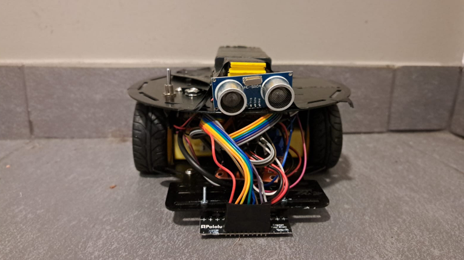
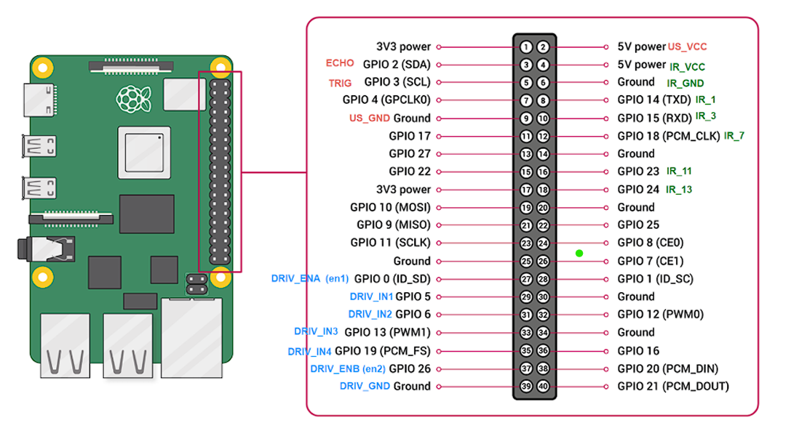
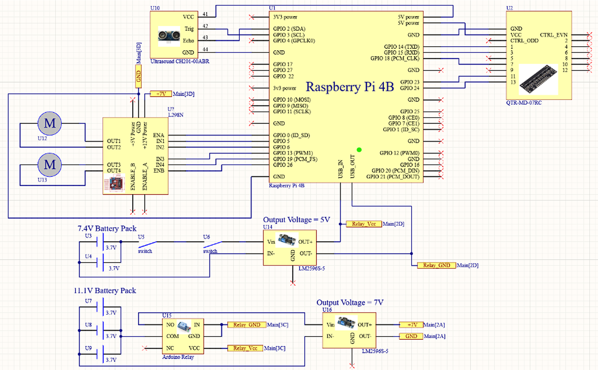

# Autonomous Line Following Warehouse Robot

Autonomous line-following warehouse robot built using a Raspberry Pi 4B, QTR-MD-07RC IR sensor array, ultrasonic obstacle detection, and differential drive motor control. The robot follows predefined paths using calibrated infrared sensors and safely stops when obstacles are detected in front of it.

> Full technical documentation available in: `Robot_Line_Follower_Documentation.pdf`

---

## Project Overview

This project demonstrates an autonomous warehouse-style mobile robot capable of:

- Following a predefined black or white tape path
- Detecting obstacles using ultrasonic sensing
- Dynamically adjusting wheel speeds using PWM motor control
- Calibrating IR sensors automatically for different surfaces
- Running fully autonomously on battery power

The system combines optoelectronics, embedded software, GPIO interfacing, and real-time sensor processing using Python on Raspberry Pi.

---

# Robot Demonstration

## Robot Hardware

<p align="center">
  
</p>

---

## Robot Following the Track

<p align="center">
  
</p>

---

# Main Features

- **Autonomous Line Following**
  - Uses QTR-MD-07RC infrared sensor array
  - Real-time tape position detection
  - Weighted sensor position calculation

- **Obstacle Detection**
  - HC-SR04 ultrasonic sensor
  - Stops robot approximately 20 cm before collision

- **IR Sensor Calibration System**
  - Automatic threshold calculation
  - Threshold validation and safety checks
  - Calibration data persistence using text files

- **Differential Drive Motor Control**
  - PWM-based speed control
  - Dynamic steering correction
  - Independent wheel adjustment

- **Multithreaded Sensor Monitoring**
  - Concurrent obstacle monitoring
  - Non-blocking robot movement

---

# Hardware Components

| Component | Purpose |
|---|---|
| Raspberry Pi 4B | Main controller |
| QTR-MD-07RC IR Array | Line detection |
| HC-SR04 Ultrasonic Sensor | Obstacle detection |
| L298N Motor Driver | DC motor control |
| 2x DC Motors | Differential drive |
| Li-Ion Battery Packs | Portable power system |
| LM2596 Voltage Regulators | Voltage regulation |

---

# System Architecture

## Raspberry Pi GPIO Connections

<p align="center">
  
</p>

---

## Electrical Schematic

<p align="center">
  
</p>

---

# Software Architecture

The project software is divided into two main Python files:

```text
Robot_main.py
│
├── Motor Control
├── Ultrasonic Monitoring
├── Main Robot Loop
├── IR Position Processing
└── Steering Logic

IRCollaboration.py
│
├── IR Calibration
├── Sensor Sampling
├── Threshold Generation
├── Threshold Validation
└── Threshold File Management
